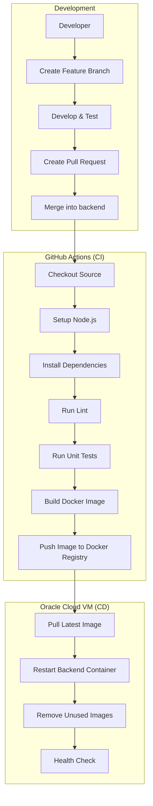

# Backend CI/CD Planning

## Overview



---

# CI Pipeline

## Trigger

- Push to `backend`
- Merge Pull Request into `backend`

---

## Step 1. Checkout Source

- Clone latest backend source code
- Checkout merged commit

---

## Step 2. Setup Environment

- Install Node.js
- Enable Docker Buildx
- Authenticate Docker Registry

---

## Step 3. Install Dependencies

```bash
pnpm install --frozen-lockfile
```

---

## Step 4. Code Quality

### Lint

```bash
pnpm lint
```

### Unit Test

```bash
pnpm test
```

---

## Step 5. Build Docker Image

```bash
docker build \
  -t username/portfolio-api:${GITHUB_SHA} \
  -t username/portfolio-api:latest .
```

Artifacts

- `portfolio-api:latest`
- `portfolio-api:<commit-sha>`

---

## Step 6. Push Docker Image

```bash
docker push username/portfolio-api:${GITHUB_SHA}
docker push username/portfolio-api:latest
```

Registry

- Docker Hub
- GitHub Container Registry (GHCR)

---

# CD Pipeline

## Step 1. Connect to Oracle VM

Using GitHub Secrets

- SSH_HOST
- SSH_USER
- SSH_PRIVATE_KEY

---

## Step 2. Pull Latest Image

```bash
docker compose pull api
```

---

## Step 3. Restart Backend Container

```bash
docker compose up -d api
```

Docker Compose will

- Stop old container
- Create new container
- Start backend

---

## Step 4. Cleanup

```bash
docker image prune -f
```

Optional

```bash
docker container prune -f
```

---

## Step 5. Health Check

```bash
curl http://localhost:8080/api/v1/health
```

Expected Response

```
HTTP 200 OK
```

If failed

- GitHub Action fails
- Deployment marked as failed

---

# GitHub Secrets

| Secret | Description |
|---------|-------------|
| DOCKER_USERNAME | Docker Hub username |
| DOCKER_PASSWORD | Docker Hub access token |
| SSH_HOST | Oracle VM IP |
| SSH_USER | SSH username |
| SSH_PRIVATE_KEY | Private SSH key |
| SERVER_PORT | Backend port (optional) |

---

# Docker Tags Strategy

| Tag | Purpose |
|------|----------|
| latest | Current production version |
| commit-sha | Immutable release |
| v1.0.0 (optional) | Versioned release |

---

# Deployment Strategy

```
Merge backend
      │
      ▼
GitHub Actions
      │
      ├── Build
      ├── Test
      ├── Docker Build
      ├── Push Registry
      └── SSH Oracle
              │
              ├── docker compose pull
              ├── docker compose up -d
              ├── docker image prune
              └── Health Check
```

---

# Project Structure

```
backend/
├── Dockerfile
├── docker-compose.yml
├── .github/
│   └── workflows/
│       └── backend-deploy.yml
└── ...
```

---

# Future Improvements

- Blue-Green Deployment
- Rolling Update
- Automatic Rollback
- Slack/Discord Deployment Notification
- Zero Downtime Deployment
- Image Vulnerability Scanning (Trivy)
- Integration Test before Deployment
- Multi-environment Deployment (Development / Staging / Production)

---