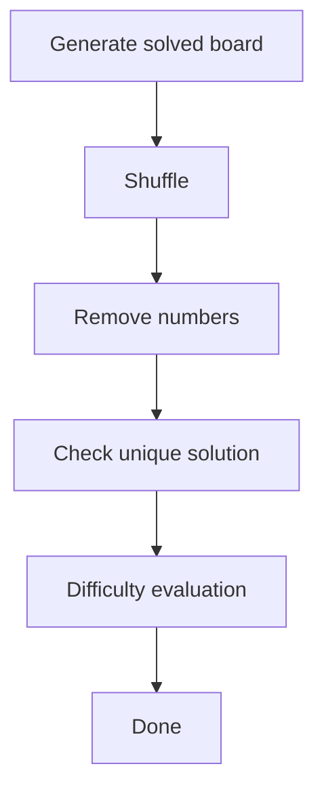

# Sudoku Development Roadmap

> **Goal:** Build a modern Sudoku game inspired by the clean, minimalist style of classic newspaper puzzle games, while maintaining an original implementation and architecture.
>
> **Tech Stack**
>
> - Next.js 16
> - React 19
> - TypeScript
> - Tailwind CSS
> - shadcn/ui
> - Framer Motion (optional)
> - LocalStorage
>
> Estimated size: **2,500–4,000 LOC**

---

# Project Structure

```text
app/
└── games/
    └── sudoku/
        page.tsx

components/
└── sudoku/
    Header.tsx
    GameInfo.tsx
    DifficultySelector.tsx
    SudokuBoard.tsx
    SudokuCell.tsx
    NumberPad.tsx
    Toolbar.tsx
    WinDialog.tsx

hooks/
    useSudokuGame.ts
    useTimer.ts
    useKeyboard.ts

lib/
└── sudoku/
    board.ts
    constants.ts
    difficulty.ts
    generator.ts
    history.ts
    solver.ts
    statistics.ts
    storage.ts
    types.ts
    utils.ts
    validator.ts
```

---

# Phase 1 — Foundation

## Goal

Build a complete playable UI.

### Features

- 9×9 Sudoku board
- Cell selection
- Keyboard input
- Number pad
- Difficulty selector
- Highlight
  - Selected cell
  - Same row
  - Same column
  - Same 3×3 box
  - Same numbers
- Responsive layout
- Dark mode

### Components

```text
Header
GameInfo
DifficultySelector
SudokuBoard
SudokuCell
NumberPad
Toolbar
```

### Deliverables

- Complete UI
- State management
- Board rendering

---

# Phase 2 — Validation & Gameplay

## Goal

Make the game playable.

### Features

- Validate moves
- Fixed cells
- Editable cells
- Erase
- Notes mode
- Pencil marks
- Keyboard shortcuts

### Keyboard

```
1-9 → Enter number
Delete → Clear
Arrow Keys → Move
Esc → Deselect
```

### Deliverables

Playable Sudoku.

---

# Phase 3 — Solver

## Goal

Implement Sudoku solving engine.

### Files

```text
solver.ts
validator.ts
```

### Features

- Backtracking solver
- Candidate checking
- Valid move checking
- Solve board
- Count solutions
- Hint support

### Deliverables

Reliable solver.

---

# Phase 4 — Generator

## Goal

Generate unlimited Sudoku puzzles.

Pipeline


### Files

```text
generator.ts
difficulty.ts
```

### Features

- Random solved board
- Puzzle generation
- Unique solution guarantee
- Seed support

### Difficulties

#### Easy

- More given numbers
- Mostly singles

#### Medium

- Moderate clues
- Requires scanning

#### Hard

- Fewer clues
- Requires advanced deduction
- Still uniquely solvable

---

# Phase 5 — Game Systems

### Undo / Redo

History stack

### Restart

Restore original puzzle.

### New Game

Generate another puzzle.

### Timer

Start automatically.

Pause on tab hidden.

### Hint

Reveal one logical move.

### Mistakes

Optional.

### Auto-check

Optional.

---

# Phase 6 — Statistics

Store locally.

### Statistics

- Games Played
- Games Won
- Best Time
- Win Rate
- Average Time
- Current Streak
- Best Streak

---

# Phase 7 — Polish

## Animation

- Cell selection
- Number placement
- Win animation

## Sound

- Click
- Error
- Complete

## Mobile

- Responsive board
- Large number pad
- Touch friendly

## Accessibility

- Keyboard navigation
- Focus indicators
- Screen reader labels

---

# Phase 8 — Persistence

### LocalStorage

Save

- Current board
- Timer
- Notes
- History
- Difficulty

Resume automatically.

---

# Future Features

## Daily Challenge

One puzzle per day.

Uses deterministic seed.

---

## Seed Sharing

Example

```
sudoku?seed=428193
```

---

## Custom Board

Create your own Sudoku.

---

## Solver Visualizer

Show solving process step-by-step.

---

## Hint Explanation

Instead of revealing a number:

```
Row 4 only allows number 7.
```

---

## Themes

- Classic
- Dark
- High Contrast

---

## Achievements

Examples

- First Win
- 10 Wins
- 100 Wins
- No Mistakes
- Under 5 Minutes

---

# Estimated LOC

| Module | LOC |
|---------|----:|
| UI | ~900 |
| Gameplay | ~500 |
| Solver | ~500 |
| Generator | ~700 |
| Statistics | ~300 |
| Polish | ~500 |
| **Total** | **~3,400 LOC** |

---

# Milestones

- ✅ **M1:** Complete UI
- ✅ **M2:** Playable Sudoku
- ✅ **M3:** Solver implemented
- ✅ **M4:** Infinite puzzle generation
- ✅ **M5:** Statistics & persistence
- ✅ **M6:** Production-ready game