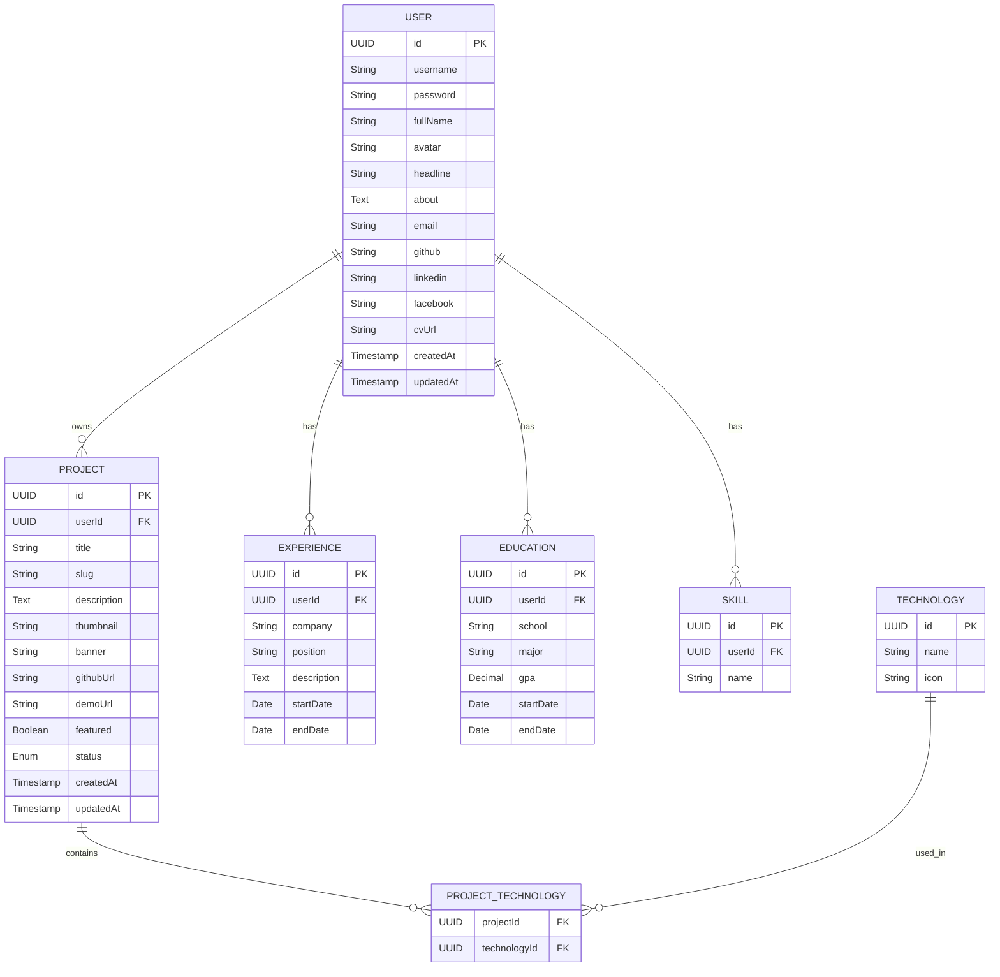

# Personal Portfolio Website

## 1. Mục tiêu

Xây dựng một website portfolio cá nhân có:

- Giao diện hiện đại, responsive.
- Trang quản trị để quản lý nội dung.
- Backend REST API.
- Database lưu trữ toàn bộ dữ liệu.
- Hệ thống Authentication.
- Có thể deploy miễn phí.
- Hỗ trợ CI/CD tự động.

---

# 2. Kiến trúc hệ thống

```
                    Cloudflare
                         │
        ┌────────────────┴────────────────┐
        │                                 │
   Next.js Frontend                Spring Boot API
      (Static)                        REST API
        │                                 │
        └────────────────┬────────────────┘
                         │
                    PostgreSQL
```

---

# 3. Công nghệ sử dụng

# Technology Stack

| Category | Technology | Version | Purpose |
|----------|------------|---------|---------|
| **Frontend** | Next.js | 16 | React Framework, SSR & App Router |
| | React | 19 | UI Library |
| | Tailwind CSS | Latest | Utility-first CSS Framework |
| | shadcn/ui | Latest | Reusable UI Components |
| | Framer Motion | Latest | Animation Library |
| | TanStack Query | Latest | Server State Management |
| | React Hook Form | Latest | Form Management |
| | Zod | Latest | Schema Validation |
| **Backend** | Java | 21 (LTS) | Programming Language |
| | Spring Boot | 3.x | Backend Framework |
| | Spring Security | 6.x | Authentication & Authorization |
| | Spring Data JPA | 3.x | ORM Layer |
| | Hibernate | 6.x | JPA Implementation |
| | Flyway | Latest | Database Migration |
| | Maven | 3.x | Dependency & Build Management |
| | Docker | Latest | Containerization |
| **Database** | PostgreSQL | 17 | Relational Database |
| **Image Storage** | Cloudinary | Free Plan | Image Hosting & CDN |
| **Authentication** | JWT | RFC 7519 | Stateless Authentication |
| | BCrypt | Spring Security | Password Hashing |
| **CI/CD** | GitHub Actions | Latest | Continuous Integration & Deployment |
| **Deployment** | Vercel | Free | Frontend Hosting |
| | Oracle Cloud Free or Render Free | Free | Backend Hosting |
| **Version Control** | Git | Latest | Source Code Management |
| | GitHub | Free | Repository Hosting |

---

# 4. Chức năng hệ thống

## Public Website

### Home

- [x] Hero Section (Avatar, tên, chức danh, giới thiệu ngắn)
- [ ] Download CV
- [ ] Contact CTA

---

### About

- [x] Personal Information
- [x] Skills
- [x] Tech Stack
- [x] Languages

---

### Experience

- [x] Experience List
  - [x] Company
  - [x] Position
  - [x] Duration
  - [x] Description

---

### Education

- [ ] Education List
  - [ ] School
  - [ ] Major
  - [ ] GPA
  - [ ] Duration

---

### Projects

- [x] Project List
- [x] Search Projects
- [x] Filter Projects
- [x] Pagination

#### Project Card

- [x] Thumbnail
- [x] Title
- [x] Short Description
- [x] Technology Tags
- [x] GitHub Link
- [x] Live Demo Link
- [x] Featured Badge

---

### Project Detail

- [ ] Banner
- [ ] Image Gallery
- [ ] Project Description
- [ ] System Architecture
- [ ] Tech Stack
- [ ] GitHub Repository
- [ ] Live Demo

---

### Contact

- [ ] Contact Information
  - [ ] Email
  - [ ] GitHub
  - [ ] LinkedIn
  - [ ] Facebook
- [ ] Download CV

---

## Admin Dashboard

### Authentication

- [x] Login
- [x] Logout
- [x] JWT Authentication
- [x] Authorization (Protected Routes)

---

### Dashboard

- [ ] Statistics Overview
- [ ] Recent Activities

---

### Profile Management

- [ ] Update Personal Information
- [ ] Update Avatar
- [ ] Update About
- [ ] Update Social Links
- [ ] Upload CV

---

### Project Management

- [ ] View Project List
- [ ] Search Projects
- [ ] Filter Projects
- [ ] Create Project
- [ ] Update Project
- [ ] Delete Project
- [ ] Upload Thumbnail
- [ ] Upload Banner
- [ ] Upload Gallery
- [ ] Manage Technologies
- [ ] Mark Featured Project

---

### Technology Management

- [ ] View Technologies
- [ ] Create Technology
- [ ] Update Technology
- [ ] Delete Technology

---

### Skill Management

- [ ] View Skills
- [ ] Create Skill
- [ ] Update Skill
- [ ] Delete Skill

---

### Experience Management

- [ ] View Experiences
- [ ] Create Experience
- [ ] Update Experience
- [ ] Delete Experience

---

### Education Management

- [ ] View Education Records
- [ ] Create Education
- [ ] Update Education
- [ ] Delete Education

---

### Upload

- [ ] Upload Images to Cloudinary
- [ ] Delete Uploaded Images
---

# 5. Admin Dashboard

## Authentication

- [x] Login
- [ ] Logout

---

## Dashboard

Thống kê:

- [ ] Tổng số Project
- [ ] Featured Project
- [ ] Tổng lượt xem (nếu có)
- [ ] Recent Update

---

## Project Management

### Danh sách Project

- [ ] Search
- [ ] Filter
- [ ] Sort

---

### Thêm Project

Bao gồm:

- [ ] Title
- [ ] Slug
- [ ] Description
- [ ] Thumbnail
- [ ] Banner
- [ ] Gallery
- [ ] GitHub URL
- [ ] Demo URL
- [ ] Featured
- [ ] Technologies

---

### Chỉnh sửa Project

Cho phép cập nhật:

- [ ] Nội dung
- [ ] Hình ảnh
- [ ] Công nghệ

---

### Xóa Project

Soft Delete hoặc Hard Delete.

---

## Personal Information

Cho phép chỉnh sửa:

- [ ] Avatar
- [ ] Name
- [ ] Headline
- [ ] About
- [ ] Email
- [ ] GitHub
- [ ] LinkedIn
- [ ] Facebook
- [ ] CV URL

---

## Experience Management

- [ ] CRUD Experience

---

## Education Management

- [ ] CRUD Education

---

## Skill Management

- [ ] CRUD Skill

---

## Technology Management

- [ ] CRUD Technology

---

# 6. Database Design

## Entity Relationship Diagram


---

# 7. REST API

| Module | Method & Endpoint | Description |
|--------|-------------------|-------------|
| **Authentication** | `POST /api/auth/login` | Authenticate user and return JWT access token |
| | `POST /api/auth/logout` | Logout current user |
| | `GET /api/auth/me` | Get authenticated user profile |
| **Profile** | `GET /api/profile` | Get public profile information |
| | `PUT /api/profile` | Update personal profile information |
| **Projects** | `GET /api/projects` | Get all projects (supports search, filter, pagination) |
| | `GET /api/projects/{slug}` | Get project details by slug |
| | `POST /api/projects` | Create a new project |
| | `PUT /api/projects/{id}` | Update an existing project |
| | `DELETE /api/projects/{id}` | Delete a project |
| **Experiences** | `GET /api/experiences` | Get all experience records |
| | `POST /api/experiences` | Create a new experience |
| | `PUT /api/experiences/{id}` | Update an experience |
| | `DELETE /api/experiences/{id}` | Delete an experience |
| **Education** | `GET /api/educations` | Get all education records |
| | `POST /api/educations` | Create a new education record |
| | `PUT /api/educations/{id}` | Update an education record |
| | `DELETE /api/educations/{id}` | Delete an education record |
| **Skills** | `GET /api/skills` | Get all skills |
| | `POST /api/skills` | Create a new skill |
| | `PUT /api/skills/{id}` | Update a skill |
| | `DELETE /api/skills/{id}` | Delete a skill |
| **Technologies** | `GET /api/technologies` | Get all technologies |
| | `POST /api/technologies` | Create a new technology |
| | `PUT /api/technologies/{id}` | Update a technology |
| | `DELETE /api/technologies/{id}` | Delete a technology |
| **Upload** | `POST /api/upload` | Upload image to Cloudinary |
| | `DELETE /api/upload/{publicId}` | Delete uploaded image |
---

# 8. Giao diện

Phong cách thiết kế:

- Minimal
- Dark Theme
- Glassmorphism nhẹ
- Responsive
- Smooth Animation

Animation:

- Fade In
- Slide
- Hover Effect
- Page Transition
- Scroll Animation

---

# 9. Triển khai (Deployment)

## Frontend

- Vercel

Ưu điểm:

- Miễn phí
- CDN
- HTTPS
- Auto Deploy từ GitHub

---

## Backend

Ưu tiên:

### Oracle Cloud Free

- Docker
- Spring Boot
- Chạy 24/7
- Không sleep

Hoặc:

### Render Free

- Dễ deploy
- Có cold start khi không có request

---

## Database

Neon PostgreSQL

- Miễn phí
- Managed Database
- Backup
- SSL

---

## Image Storage

Cloudinary

- Miễn phí
- CDN
- Image Optimization

---

# 10. CI/CD

```
GitHub
      │
      ▼
GitHub Actions
      │
      ├────────────► Vercel (Frontend)
      │
      └────────────► Backend Server
```

Quy trình:

1. Push code lên GitHub.
2. GitHub Actions chạy kiểm tra và build.
3. Frontend tự động deploy lên Vercel.
4. Backend tự động build Docker image và triển khai.
5. Website được cập nhật sau mỗi lần merge vào `main`.

---